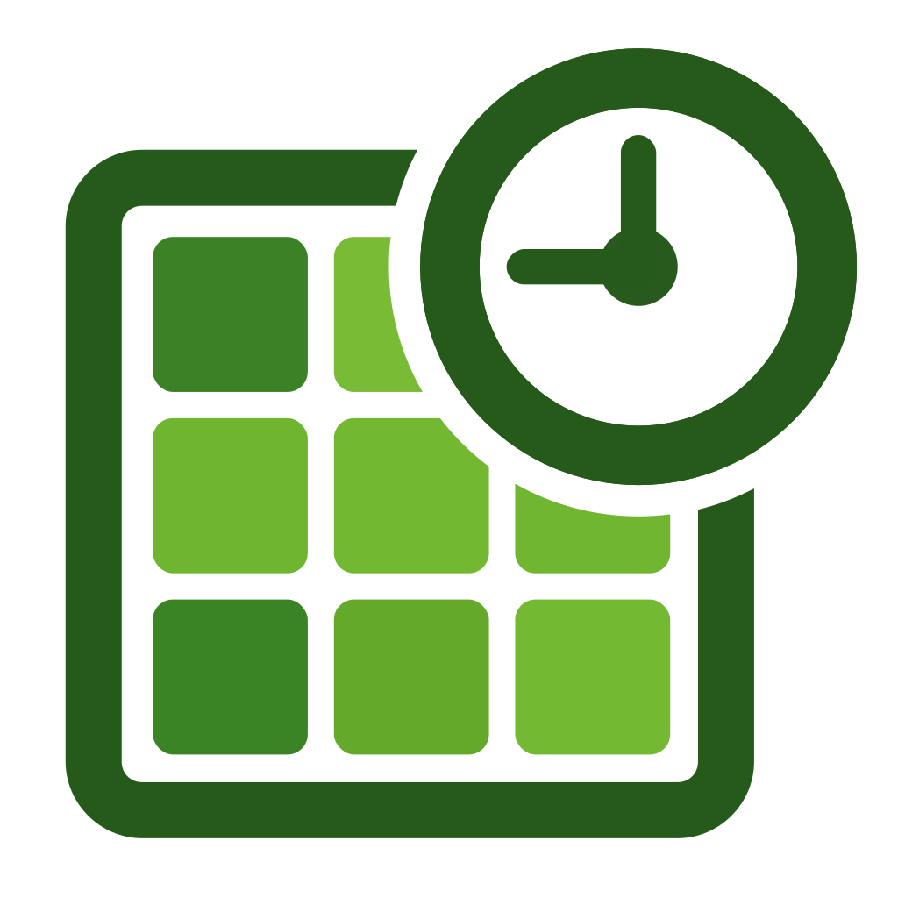
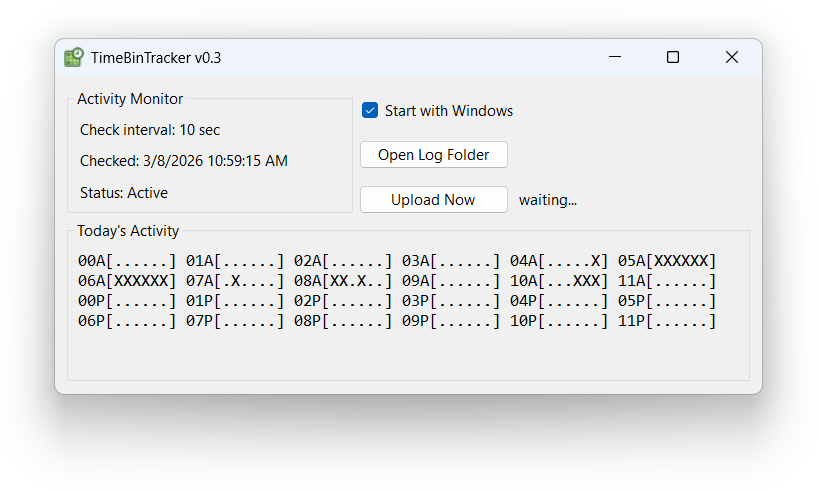
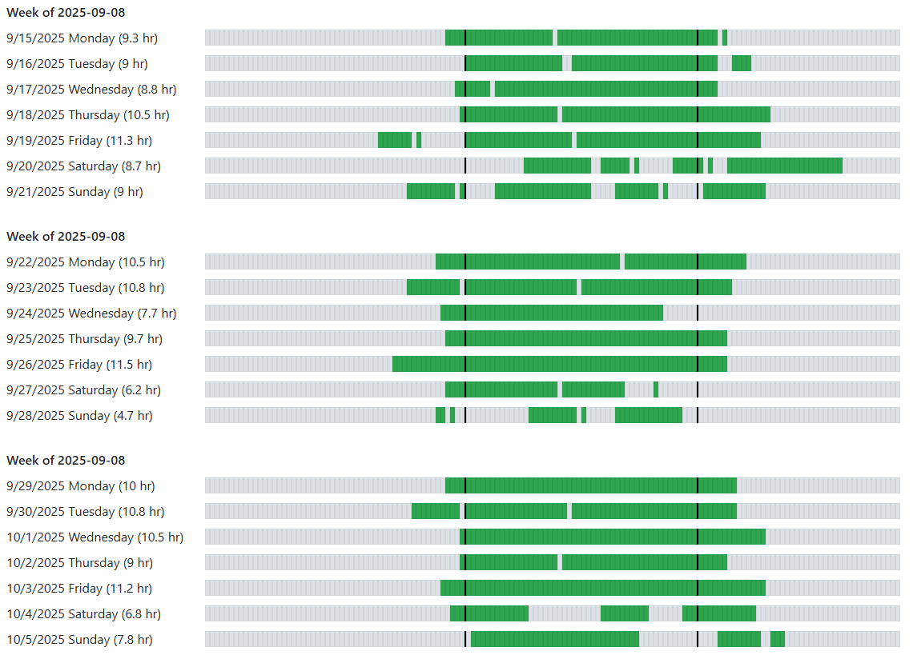

# TimeBinTracker 

TimeBinTracker is a minimal computer use tracker I use to track my activity across multiple computers in real time.

* **A desktop app detects activity** every few minutes and logs it to the filesystem. Occasionally it syncs activity data with the cloud.

* **A website displays real-time activity data** aggregated across all devices.

## Screenshots

## Design Goals

* **Anonymous activity** - Although mouse and window titles are used to detect activity, only timestamps of activity are recorded.

* **Multi-Computer Activity** - This system can run on multiple computers at the same time, allowing me to visualize activity across multiple desktop and laptop computers.

* **Real-Time Web Interface** - I want to open a URL on my phone and see a live estimate of how many hours I've worked this week.

## Implementation
* Desktop application - .NET 10 WinForms
* Web backend - PHP 8
* Web frontend - React 19